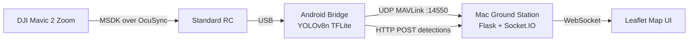

# Lattice Bridge

Real-time drone surveillance pipeline inspired by Anduril Lattice. Connects a DJI Mavic 2 Zoom to a Mac-based ground station via Android phone bridge — streams telemetry, live video, and YOLO object detections to a Leaflet map UI in real-time, with detected objects georeferenced via monocular pinhole projection.

Built as a learning and portfolio project to explore the technical problems of building a Lattice-style C2 (command & control) system on commodity hardware.

## Architecture



The drone streams telemetry via DJI Mobile SDK to the Android app. The phone runs YOLOv8n inference on grabbed video frames at 2 Hz, then forwards telemetry and detection pixel coordinates to the Mac server. The server uses pinhole projection — combining drone GPS, altitude, attitude, and gimbal pose — to convert each detection's pixel coordinates into ground GPS coordinates, rendered as red markers on the Leaflet map.

## Tech Stack

- **Android (Kotlin):** DJI Mobile SDK 4.16.4, TensorFlow Lite (YOLOv8n INT8), Camera/Gimbal/Compass APIs
- **Server (Python 3.9):** Flask + Flask-SocketIO, pinhole geometry, MAVLink UDP listener
- **UI:** Leaflet.js, vanilla JS, custom marker rendering with spatial dedup and click-to-pin
- **Hardware:** DJI Mavic 2 Zoom + standard RC + Redmi 13 Android phone + MacBook

## Project Status

| Stage | Description | Status |
|-------|-------------|--------|
| 1 | Telemetry pipeline (GPS, attitude, gimbal) | Complete |
| 2 | FOV trapezoid projection on map | Complete |
| 3 | Live video feed (DJICodecManager.getBitmap @ 2 Hz) | Complete |
| 4A | YOLO person/object detection + georeferencing | Complete (accuracy validation ongoing) |
| 4B | AR overlay on second phone | Future work |

## Key Engineering Decisions

**Frame grab via `DJICodecManager.getBitmap()`, not `setYuvDataCallback()`.** The YUV callback approach (commonly documented) blocks the SurfaceTexture rendering path on the Mavic 2 Zoom, killing the visible video feed. Using `getBitmap()` on a 500ms timer coexists with rendering and delivers 1280×720 RGB frames suitable for YOLO inference.

**Compass heading from `flightController.compass.heading`, not `attitude.yaw`.** Side-by-side comparison with DJI GO 4 revealed that `attitude.yaw` drifts 100°+ from the true magnetic heading. The `compass.getHeading()` API matches DJI GO 4's compass readout.

**Gimbal yaw set to 0 on Mavic 2 Zoom.** The Mavic 2 Zoom's gimbal yaw is mechanically locked to the aircraft body — passing the SDK's gimbal yaw value to the server caused double-counting in the camera heading computation.

**YOLOv8n exported via `onnx2tf` for TFLite.** This export produces normalized 0..1 bounding box coordinates, NOT the pixel 0..640 range used by standard Ultralytics PyTorch outputs. Postprocessing multiplies by input size before NMS — discovered empirically when all detections landed at the same map coordinate.

**Spatial dedup on map markers** (3m threshold, same label) prevents clustering from rapid drone rotation × magnetometer jitter. Markers refresh their fade timer instead of stacking.

## Setup

### Server
```bash
cd server
python3 -m venv venv
source venv/bin/activate
pip install -r requirements.txt
python app.py
```
Server listens on `:5000` (HTTP/WebSocket) and `:14550` (MAVLink UDP). Open `http://localhost:5000` in browser to see the map.

### Android
1. Open `android/` in Android Studio
2. Copy `android/local.properties.example` → `android/local.properties`
3. Get a DJI API key from https://developer.dji.com and paste it into `local.properties`:
```
   dji.api.key=YOUR_DJI_API_KEY_HERE
```
4. Build & install:
```bash
   cd android
   ./gradlew assembleDebug
   adb install -r app/build/outputs/apk/debug/app-debug.apk
```
5. Connect phone via USB to the standard DJI RC (Mavic 2 Zoom powered on).

Phone and Mac must be on the same WiFi. Default server IP is `192.168.1.11`; adjust in the app for your Mac's address.

## Limitations

**Monocular georef accuracy is geometrically bounded.** Marker distance is `altitude / tan(|gimbal_pitch|)`. At low altitudes with near-horizontal camera, distant objects project inaccurately. Recommended operating envelope: altitude 15–30m, gimbal pitch −45° to −60°.

**Magnetometer drift near metal infrastructure** (steel bridges, rebar, large vehicles) can introduce up to ±20° heading error, translating to lateral marker error proportional to range.

**Detection only, no tracking** — multiple objects per frame are detected and shown simultaneously, but objects have no persistent IDs across frames. The same object detected on two consecutive frames produces two independent markers (the 3m spatial dedup hides this when stationary).

**Single drone, single operator.** No fleet management, no air-traffic deconfliction. This is a learning project, not a production C2 system.

## Future Work

- **Stage 4B: AR overlay on a second phone** — handheld view showing detection markers overlaid on phone camera using magnetometer + gyro fusion (no ARCore), with drone-tap calibration to offset compass bias.
- **NNAPI / GPU delegate** for TFLite inference (currently CPU-only at ~500ms per frame; expected 2-3× speedup).
- **Accuracy measurement campaign** — field trials with known-GPS ground truth to populate empirical error tables.

## License

MIT
