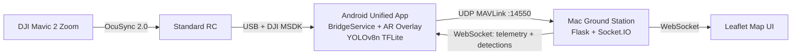
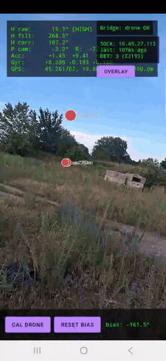
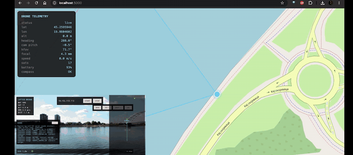

# Lattice Bridge

Real-time drone surveillance pipeline inspired by Anduril Lattice. Connects a DJI Mavic 2 Zoom to a Mac-based ground station via Android phone bridge — streams telemetry, live video, and YOLO object detections to a Leaflet map UI in real-time, with detected objects georeferenced via monocular pinhole projection.

Built as a learning and portfolio project to explore the technical problems of building a Lattice-style C2 (command & control) system on commodity hardware.


## Architecture


```mermaid
flowchart LR
    Drone[DJI Mavic 2 Zoom] -->|OcuSync 2.0| RC[Standard RC]
    RC -->|USB + DJI MSDK| Phone[Android Unified App<br/>BridgeService + AR Overlay<br/>YOLOv8n TFLite]
    Phone -->|UDP MAVLink :14550| Mac[Mac Ground Station<br/>Flask + Socket.IO]
    Mac -->|WebSocket: telemetry + detections| Phone
    Mac -->|WebSocket| Browser[Leaflet Map UI]
```

The drone streams telemetry via DJI Mobile SDK to the Android app. The phone runs YOLOv8n inference on grabbed video frames at 2 Hz, then forwards telemetry and detection pixel coordinates to the Mac server. The server uses pinhole projection — combining drone GPS, altitude, attitude, and gimbal pose — to convert each detection's pixel coordinates into ground GPS coordinates, rendered as red markers on the Leaflet map.

## Tech Stack

- **Android (Kotlin):** DJI Mobile SDK 4.16.4, TensorFlow Lite (YOLOv8n INT8), Camera/Gimbal/Compass APIs
- **Server (Python 3.9):** Flask + Flask-SocketIO, pinhole geometry, MAVLink UDP listener
- **UI:** Leaflet.js, vanilla JS, custom marker rendering with spatial dedup and click-to-pin
- **Hardware:** DJI Mavic 2 Zoom + standard RC + Redmi 13 Android phone + MacBook

## Project Status

| Stage | Description | Status |
|-------|-------------|--------|
| 1 | Telemetry pipeline (GPS, attitude, gimbal) | Complete |
| 2 | FOV trapezoid projection on map | Complete |
| 3 | Live video feed + frame grab for inference (DJICodecManager.getBitmap, 1-2 Hz) | Complete |
| 4A | YOLO person/object detection + georeferencing | Complete |
| 4B | AR overlay (unified single-phone app) | Complete (field-validated) |

### AR Overlay (Stage 4B)

The unified app combines the BridgeService (drone telemetry + YOLO inference) with an AR overlay view. The phone camera shows the real world with detection markers superimposed at their projected GPS positions; drone-tap calibration compensates for phone compass bias.




## Key Engineering Decisions

**Frame grab via `DJICodecManager.getBitmap()`, not `setYuvDataCallback()`.** The YUV callback approach (commonly documented) blocks the SurfaceTexture rendering path on the Mavic 2 Zoom, killing the visible video feed. Using `getBitmap()` on a 500ms timer coexists with rendering and delivers 1280×720 RGB frames suitable for YOLO inference.

**Compass heading from `flightController.compass.heading`, not `attitude.yaw`.** Side-by-side comparison with DJI GO 4 revealed that `attitude.yaw` drifts 100°+ from the true magnetic heading. The `compass.getHeading()` API matches DJI GO 4's compass readout.

**Gimbal yaw set to 0 on Mavic 2 Zoom.** The Mavic 2 Zoom's gimbal yaw is mechanically locked to the aircraft body — passing the SDK's gimbal yaw value to the server caused double-counting in the camera heading computation.

**YOLOv8n exported via `onnx2tf` for TFLite.** This export produces normalized 0..1 bounding box coordinates, NOT the pixel 0..640 range used by standard Ultralytics PyTorch outputs. Postprocessing multiplies by input size before NMS — discovered empirically when all detections landed at the same map coordinate.

**Spatial dedup on map markers** (3m threshold, same label) prevents clustering from rapid drone rotation × magnetometer jitter. Markers refresh their fade timer instead of stacking.

## Setup

### Server
```bash
cd server
python3 -m venv venv
source venv/bin/activate
pip install -r requirements.txt
python app.py
```
Server listens on `:5000` (HTTP/WebSocket) and `:14550` (MAVLink UDP). Open `http://localhost:5000` in browser to see the map.

### Android — Bridge app (Stages 1–4A, streams to Mac map UI)
1. Open `android/` in Android Studio
2. Copy `android/local.properties.example` → `android/local.properties`
3. Get a DJI API key from https://developer.dji.com and paste it into `local.properties`:
```
   dji.api.key=YOUR_DJI_API_KEY_HERE
```
4. Build & install:
```bash
   cd android
   ./gradlew assembleDebug
   adb install -r app/build/outputs/apk/debug/app-debug.apk
```
5. Connect phone via USB to the standard DJI RC (Mavic 2 Zoom powered on). Telemetry, video frames, and YOLO detections stream to the Mac server; view the map at `http://<mac-ip>:5000`.

### Android — Unified app (Stage 4B, AR overlay + Bridge in one APK)
The unified app subsumes the Bridge app and adds AR overlay rendered directly on the phone camera. Run **either** the Bridge app **or** the Unified app, not both — they share the same `applicationId` and DJI API key binding.

1. Open `android-unified/` in Android Studio
2. Copy `android-unified/local.properties.example` → `android-unified/local.properties` and paste your DJI API key (same key works for both apps)
3. Build & install:
```bash
   cd android-unified
   ./gradlew assembleDebug
   adb install -r app/build/outputs/apk/debug/app-debug.apk
```
4. Connect phone via USB to the standard DJI RC.
5. Tap the mode button (top-right corner) to switch between:
   - **OVERLAY mode** (portrait) — phone camera + AR detection markers projected onto the real world, with drone-tap compass calibration
   - **BRIDGE mode** (landscape) — drone video feed + HUD (battery, satellites, altitude, speed, distance from home) + gimbal pitch and zoom sliders

Phone and Mac must be on the same WiFi (or use the phone's hotspot — Mac joins the field network via the phone). Default server IP is `192.168.1.11`; adjust in the app for your Mac's address.

## Accuracy

<p align="center">
  
</p>


Field-measured georef accuracy with operator (target) stationary on a known GPS point and the drone hovering at varying altitude and distance. Ground truth was measured via phone GPS (long-press in Google Maps); marker coordinates from the app's COPY LAST button.

**Ground truth:** `45.266426, 19.863698` (Novi Sad, Danube quay, bench)

| # | Alt (m) | Pitch (°) | Real dist** (m) | HFOV (°) | Zoom | Offset (m) |
|---|---------|-----------|------------------|----------|------|------------|
| 1 | 10.0 | -35.6 | 11.4 | 71.7 | 1.0x | **3.50** |
| 2 | 20.3 | -54.5 | 12.3 | 35.8 | 2.2x | **2.28** |
| 3 | 20.2 | -37.6 | 23.8 | 38.2 | 2.1x | **4.28** |
| 4 | 20.4 | -31.3 | 31.6 | 21.9 | 3.7x | **6.42** |
| 5 | 30.0 | -42.2 | 32.0 | 24.0 | 3.4x | **10.78** |
| 6 | 20.1 | -21.2 | 52.2 | 20.5 | 4.0x | **8.48** |
| 7 | 29.5 | -28.5 | 52.3 | 20.5 | 4.0x | **12.08** |

** Real dist = actual horizontal GPS distance from drone to ground truth point (haversine, not the geometric projection from pitch).

**Summary:** mean offset **6.8m**, min **2.3m**, max **12.1m** across 7 trials in a single flight session. All trials under 13m without any RTK GPS, calibration grid, or post-processing — purely monocular pinhole projection from drone state telemetry.

**Observations:**

- **Trial #1** (10m alt, no zoom, ~11m real distance) gave **3.50m** offset — baseline close-range accuracy with wide FOV.
- **Trials #2-#7 required optical zoom** (Mavic 2 Zoom, 2-4x focal range). At distances of 20m+ the person bbox in the wide-FOV frame is too small for reliable YOLO detection. The server reads the live `hfov` from telemetry, so geometric projection scales correctly with zoom — accuracy was not degraded by zooming, in fact several mid-range zoom trials (#2, #3) achieved offsets under 5m.
- **Offset grows roughly with distance**, as expected. At fixed angular uncertainty in camera pose (compass + gimbal pitch noise), error amplifies linearly with projection range. Worst case (#7, ~53m real distance) was 12.08m, dominated by the lateral component (compass heading drift).
- Phone GPS itself has ~3-5m precision, so true system error is likely lower than reported figures by that amount.

## Limitations

**Monocular georef accuracy is geometrically bounded.** Marker distance is `altitude / tan(|gimbal_pitch|)`. At low altitudes with near-horizontal camera, distant objects project inaccurately. Recommended operating envelope: altitude 15–30m, gimbal pitch −45° to −60°.

**Phone compass calibration sensitivity.** AR overlay projection on the phone uses the phone's magnetometer for heading, which requires careful manual calibration before each session and can drift ±5-15° over a flight if the phone is near metal or electronics. A drone-tap calibration step in the app (tap the visible drone in the AR view) re-aligns the bias. Drone heading itself comes from DJI's onboard sensor fusion and is independent.

**Detection only, no tracking** — multiple objects per frame are detected and shown simultaneously, but objects have no persistent IDs across frames. The same object detected on two consecutive frames produces two independent markers (the 3m spatial dedup hides this when stationary).

**Single drone, single operator.** No fleet management, no air-traffic deconfliction. This is a learning project, not a production C2 system.

## Future Work

- **Drone-camera AR projection.** Currently AR markers only render on the phone camera view; projecting detection markers onto the drone video feed (same pinhole math, reversed) would let an operator visually confirm detections against the aerial view.
- **Per-device camera FOV calibration.** Phone camera HFOV is currently a hardcoded ~67°; a one-time calibration step (point at known-distance object) would tighten AR projection accuracy.
- **Multi-frame detection tracking.** Persistent object IDs across consecutive frames would enable trajectory rendering and "object pinned for N seconds" UI, instead of the current frame-by-frame independent markers.

## License

MIT
